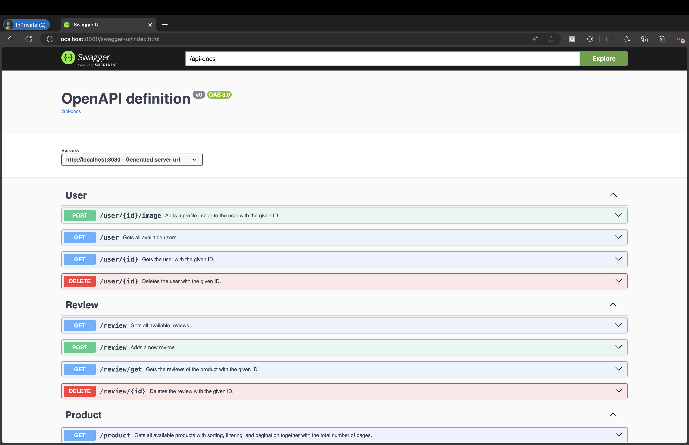

# Mercatura-Backend
The repository containing the backend of Mercatura project. 
[Parent repository](https://github.com/nijatkazimli/Mercatura)

## Intro
Mercatura is an e-commerce website with features, including but not limited to:
- Products with specific categories
- 3 different roles: Admin, Merchandiser, Regular User
- "Playlist" logic carts &ndash; User can have multiple carts and pay them separately
- Comprehensive admin dashboard
- And many more

## Techstack
- Java Spring Boot (17)
- JPA
- Password Encoder
- Swagger, OpenAPI
- MySQL (8.1)
- Postman
- [Azurite](https://learn.microsoft.com/en-us/azure/storage/common/storage-use-azurite?tabs=visual-studio%2Cblob-storage) &ndash; local equivalent of Azure Storage (used for images)
- Docker &ndash; docker-compose, multi-stage images for smaller image sizes

You can take a look at how API looks like using a user friendly way, [Swagger](http://localhost:8080/swagger-ui/index.html),
or Postman collection in the backend directory. 
 

## Code structure
  - configuration &ndash; contains security configurations (filter chain, CORS).
  - controller &ndash; contains the controller classes.
  - dto &ndash; contains Data Transmission Objects (response, request body).
  - entity &ndash; contains blueprints about how tables should look like in the database.
  - repository &ndash; contains the context about the type of repositories.
  - service &ndash; contains the interaction logics between controller and repositories.
  - specification &ndash; contains filtering SQL builder for entities (for now only Product).
  - utils &ndash; contains utility classes.
